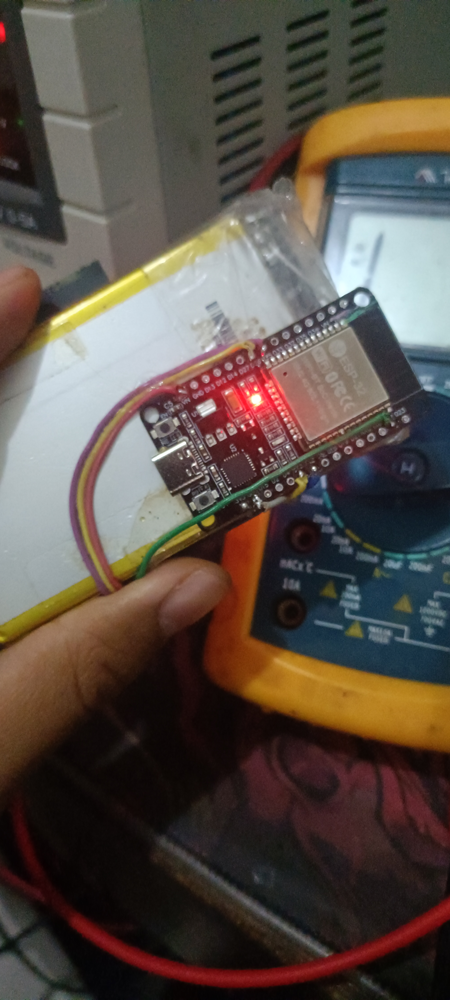
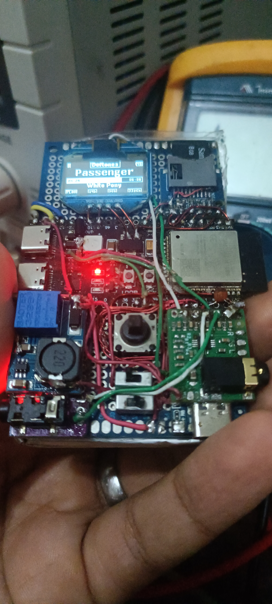

# mps3 — Player de Áudio Digital Hi-Res (DAP) Dual-MCU com Transmissão Sony LDAC 24-bit / 96 kHz

[](#visao-geral)
[](docs/WIRING.md)
[](#o-que-funciona-muito-bem)
[%20%7C%20SBC-purple.svg)](#o-que-funciona-muito-bem)
[](LICENSE)

<p align="center">
  
  
</p>

O **mps3** é um player de áudio digital portátil de alta fidelidade (**Hi-Res Digital Audio Player / DAP**) de arquitetura aberta, construído em torno de **dois microcontroladores (Dual-MCU)** que trabalham em perfeita sincronia. O projeto foi projetado para entregar uma experiência sonora pura e sem perdas, reproduzindo músicas do cartão micro SD com resolução de estúdio tanto pela saída analógica cabeada (via DAC dedicado) quanto sem fio pelo Bluetooth com o codec audiófilo **Sony LDAC em 24-bit / 96 kHz** reais.

A divisão de trabalho entre dois processadores independentes evita gargalos de desempenho e garante áudio fluido sem qualquer engasgo:

1. **Placa Principal (ESP32-S3 N16R8)**:
   Gerencia a leitura do cartão micro SD em alta velocidade (SDMMC 4 vias a 40 MHz), decodifica arquivos Hi-Res (**FLAC 24-bit / 96 kHz nativo**, MP3, WAV, AAC, M4A, OGG), processa a equalização paramétrica de 10 bandas, comanda a interface visual no display OLED com joystick de 5 direções e transmite o áudio digital PCM nativo (até 24-bit / 96 kHz) via barramento I2S tanto para o conversor DAC local quanto para o módulo Bluetooth.

2. **Co-Processador de Bluetooth (`bt_companion` — ESP32 Clássico)**:
   Dedicado exclusivamente ao rádio sem fio. Recebe o áudio PCM digital vindo do S3 via I2S, processa a codificação em tempo real com **Sony LDAC 24-bit / 96 kHz** (com taxa dinâmica adaptativa entre 330 e 990 kbps) ou **SBC** de alta qualidade, além de sincronizar o volume absoluto do fone via AVRCP.

3. **Receptor de Validação (`bt_audio_sink` — ESP32 Clássico)**:
   Firmware auxiliar de bancada para receber, auditar e testar a integridade e latência dos pacotes transmitidos pelo `mps3`.

---

## ⚠️ Transparência do Projeto: O Que Funciona e Limitações Atuais

Este projeto preza pela honestidade técnica e relata com clareza o estado real de cada funcionalidade comprovado em bancada:

### ✅ O Que Funciona Muito Bem

* **Áudio Hi-Res Real em 24-bit / 96 kHz de Ponta a Ponta**: Arquivos FLAC de 24 bits e 96.000 Hz são lidos do micro SD, decodificados sem nenhum truncamento para 16 bits e codificados pelo encoder Sony LDAC nativamente em 24-bit / 96 kHz, chegando ao conversor digital do fone sem perda de resolução ou dinâmica.
* **Sony LDAC com Bitrate Adaptativo (ABR)**: Opera em até **990 kbps (qualidade máxima)**. Se houver interferência no sinal sem fio, o sistema ajusta temporariamente a taxa para 660 ou 330 kbps para manter o som contínuo sem estalos, retornando aos 990 kbps assim que o enlace estabilizar.
* **SBC de Alta Fidelidade**: Garante compatibilidade imediata com qualquer fone ou caixa Bluetooth do mercado em 44.1 ou 48 kHz (Bitpool 53, estéreo de alta qualidade).
* **Decodificação de Múltiplos Formatos no S3**: Suporte completo a **FLAC** (16 e 24 bits, até 96 kHz), **MP3** (CBR/VBR até 320 kbps), **WAV** (PCM 16 e 24 bits), **AAC / M4A** e **OGG Vorbis**.
* **Leitura Rápida do Cartão SD (SDMMC 4-Bit)**: Barramento nativo de 4 vias a 40 MHz, permitindo navegar ágil pelas pastas e carregar arquivos pesados sem esvaziamento de buffer.
* **Equalizador Paramétrico de 10 Bandas**: Filtros IIR biquad com ganho configurável de -12 dB a +12 dB. Possui **bypass automático inteligente acima de 48 kHz** para não introduzir distorções de fase nem sobrecarregar o processamento em faixas Hi-Res de 96 kHz.
* **Interface Monocromática Fluida no OLED SSD1306**: Navegação intuitiva com joystick de 5 direções, menus em carrossel, visualização da biblioteca por pastas e arquivos, além da tela "Now Playing" com dados da faixa, formato, taxa de amostragem, profundidade de bits e tempo decorrido.
* **Persistência de Estado (NVS)**: Grava e recupera automaticamente a última música tocada, o ponto exato onde a reprodução foi pausada, o volume atual e a preferência de codec.
* **Gerenciador de Músicas via Wi-Fi (`mps3.local`)**: Ao ativar o modo Wi-Fi, o mps3 cria um servidor web acessível na rede local para upload de álbuns e faixas diretamente pelo navegador, dispensando a remoção física do cartão.
* **Controle de Volume Bidirecional (AVRCP)**: Modificar o volume no joystick do mps3 atualiza o volume no fone, e os botões físicos do próprio fone também refletem instantaneamente no mps3 via UART.

### ❌ O Que Não Funciona ou Está Desativado Nesta Versão

* **Montagem do Cartão SD via USB no Computador (USB Mass Storage / MSC)**: **Quebrado**. A biblioteca de USB MSC do ESP32-S3 entra em conflito de concorrência com o driver SDMMC de 4 vias ativo. Conectar o cabo USB ao computador para transferir faixas pode travar a controladora ou corromper a partição FatFS. **Para transferir músicas, utilize um leitor de cartão SD convencional no computador ou faça o envio sem fio pela interface web (`mps3.local`).**
* **Modo Placa de Som USB (USB Audio Class / DAC)**: **Desativado**. O modo de usar o mps3 como DAC USB conectado ao computador não está funcional nesta versão.
* **Codecs Qualcomm aptX e aptX HD no Bluetooth Companion**: **Não funcionam**. Embora as rotinas dos encoders e as descrições dos endpoints estejam presentes na árvore do projeto, o fluxo de empacotamento RTP e a negociação AVDTP falham na sincronização com fones comerciais. **A transmissão Bluetooth ocorre com estabilidade comprovada via Sony LDAC e SBC**.
* **Decodificador Opus**: **Experimental**. Faixas Opus com taxas de compressão complexas demandam um tamanho de pilha FreeRTOS muito alto, podendo gerar instabilidades se a tarefa de áudio estiver com limites restritos de memória.

---

## 📐 Arquitetura do Sistema

```text
+-----------------------------------------------------------------------------------------+
|                                    mps3 (Placa Principal - ESP32-S3)                    |
|                                                                                         |
|  +--------------------+        +-----------------------+        +--------------------+  |
|  | MicroSD (SDMMC 4b) | -----> |  Decodificador Hi-Res | -----> |   Equalizador IIR  |  |
|  |  FLAC / MP3 / WAV  |        |  (Core 1 - 24b/96kHz) |        |   10 Bandas Biquad |  |
|  +--------------------+        +-----------------------+        +--------------------+  |
|                                                                            |            |
|  +--------------------+        +-----------------------+                   v            |
|  | Display OLED I2C   | <..... | Menu / GUI / Joystick |        +--------------------+  |
|  | (SSD1306 128x64)   |        | (Core 0 - Interface)  |        |  Driver I2S Master |  |
|  +--------------------+        +-----------------------+        |  DMA 32-bit Stereo |  |
|                                            :                    +--------------------+  |
|                                            : UART                          | I2S        |
+--------------------------------------------:-------------------------------:------------+
                                             : (115200 8N1)                  |            |
                                             v                               |            |
+--------------------------------------------------------------------+       |            |
|                     ESP32 Clássico (Co-Processador bt_companion)   |       |            |
|                                                                    |       |            |
|  +--------------------+   +--------------------+   +-------------+ |       |            |
|  | Controle UART Link |   |  Reamostrador 32.32|   |  I2S Slave  | <-------+            |
|  | (Core 0 - Estado)  |   | (Pass-thru em 96k) |   | (PIN 26/25) | |       |            |
|  +--------------------+   +--------------------+   +-------------+ |       |            |
|             |                         |                            |       |            |
|             v                         v                            |       |            |
|  +--------------------+   +--------------------+                   |       |            |
|  |  AVRCP Controller  |   | Sony LDAC Encoder  |                   |       |            |
|  |  (Absolute Volume) |   | (24-bit / 96 kHz)  |                   |       |            |
|  +--------------------+   +--------------------+                   |       |            |
|             |                         |                            |       |            |
|             +------------+------------+                            |       |            |
|                          v                                         |       |            |
|             +--------------------------+                           |       |            |
|             | Pilha Bluedroid BT A2DP  |                           |       |            |
|             | Multi-SEP (Vendor LDAC)  |                           |       |            |
|             +--------------------------+                           |       |            |
|                          |                                         |       |            |
+--------------------------:-----------------------------------------+       |            |
                           : Bluetooth A2DP / AVRCP                          v            |
                           v                                        +-------------------+ |
               +-----------------------+                            |   DAC PCM5102A    | |
               | Fone de Ouvido / Caixa|                            | (Saída P2 Fones)  | <+
               | Bluetooth Sem Fio     |                            +-------------------+
               +-----------------------+
```

---

## 🗂️ Estrutura dos Repositórios

O ecossistema é dividido em três diretórios de firmware independentes:

| Diretório | Plataforma | Finalidade |
|---|:---:|---|
| **[`1_esp32s3_player/`](1_esp32s3_player/)** | ESP32-S3 (N16R8) | Firmware principal do mps3: decodificação de áudio, SDMMC, OLED, equalizador e saída I2S Master. |
| **[`2_esp32_bt_companion/`](2_esp32_bt_companion/)** | ESP32 Clássico | Co-processador transmissor Bluetooth: entrada I2S Slave, Sony LDAC 24/96, SBC e controle ABR. |
| **[`3_esp32_bt_audio_sink/`](3_esp32_bt_audio_sink/)** | ESP32 Clássico | Receptor Bluetooth de bancada para validar pacotes, latência e estabilidade do sinal. |
| **[`docs/`](docs/)** | — | Manual de navegação e botões ([MANUAL.md](docs/MANUAL.md)), esquemas elétricos ([WIRING.md](docs/WIRING.md)) e protocolo serial ([PROTOCOL.md](docs/PROTOCOL.md)). |

---

## 🔌 Tabela Geral de Pinagem e Conexões

### 1. Barramento de Áudio Digital I2S (Compartilhado entre os 3 chips)
*O ESP32-S3 gera os sinais de sincronismo (Master). O DAC PCM5102A e o ESP32 Companion recebem os dados em paralelo.*

| Sinal I2S | ESP32-S3 (Master TX) | ESP32 Companion (Slave RX) | DAC PCM5102A | Observações |
|---|:---:|:---:|:---:|---|
| **BCLK** (Bit Clock) | **GPIO 48** | **GPIO 26** | **BCK** | Clock de bits síncrono |
| **LRCK / WS** (Word Select) | **GPIO 21** | **GPIO 25** | **LCK** | Frequência de amostragem da faixa (ex: 96 kHz) |
| **DOUT / DIN** (Dados PCM) | **GPIO 47** | **GPIO 22** | **DIN** | Dados de áudio PCM estéreo |
| **GND** | GND | GND | GND / SCK | **SCK do PCM5102A deve ser conectado ao GND** |

### 2. Barramento de Controle UART (Comunicação S3 ↔ Companion)

| Sinal | ESP32-S3 | ESP32 Companion | Parâmetros |
|---|:---:|:---:|---|
| **TX → RX** | **GPIO 14** (TXD1) | **GPIO 16** (RXD1) | 115200 bps, 8N1, binário com checksum |
| **RX ← TX** | **GPIO 13** (RXD1) | **GPIO 17** (TXD1) | 115200 bps, 8N1, binário com checksum |
| **RESET / EN** | **GPIO 12** | **EN / CHIP_PU** | Reset por hardware do co-processador |

### 3. Periféricos da Placa Principal (ESP32-S3)

| Periférico | Função | Pinos no ESP32-S3 |
|---|---|---|
| **Display OLED SSD1306** | I2C (128x64 monocromático) | **SDA: GPIO 10** \| **SCL: GPIO 9** (alimentação 3.3V) |
| **Cartão micro SD** | Barramento SDMMC 4-Bit (Slot nativo) | **CLK: GPIO 5** \| **CMD: GPIO 6** \| **D0: GPIO 4** \| **D1: GPIO 17** \| **D2: GPIO 16** \| **D3: GPIO 7** |
| **Joystick de 5 Vias** | Botões de navegação | **UP: GPIO 2** \| **LEFT: GPIO 39** \| **DOWN: GPIO 41** \| **RIGHT: GPIO 42** \| **CENTER: GPIO 40** |
| **Monitor de Bateria & TP4056** | Divisor Li-Ion + status TP4056 | **ADC: GPIO 1** (Tensão Li-Ion) \| **CHRG: GPIO 11** (LED Carregando) |
| **LED RGB WS2812** | Feedback visual on-board | **DIN: GPIO 38** |

---

## 🚀 Guia de Primeiro Uso (Quick Start: Do Zero ao Som em 10 Minutos)

Se você acabou de montar o hardware ou compilar o projeto pela primeira vez, siga este passo a passo:

### 1. Preparação do Cartão MicroSD (Formatação e Requisitos)

| Especificação | Detalhes Técnicos |
|---|---|
| **Capacidade Suportada** | **Até 2 TB (padrão SDXC)**. Testado e homologado com cartões de **16 GB, 32 GB, 64 GB, 128 GB e 256 GB**. |
| **Sistema de Arquivos Obrigatório** | **FAT32** (o driver FatFS do ESP-IDF não lê exFAT nativamente). |
| **Tamanho da Unidade de Alocação (Cluster)** | **32 KB ou 64 KB** (clusters de 64 KB aumentam o throughput e reduzem o tempo de busca). |
| **Velocidade Mínima Recomendada** | **Classe 10 / UHS-I U1 ou U3** (para leitura contínua de faixas 24b/96kHz sem engasgos). |

> [!TIP]
> **Cartões de 64 GB ou maiores:** Por padrão, o Windows formata cartões acima de 32 GB em exFAT. Para usar cartões de 64 GB, 128 GB ou 256 GB no **mps3**, utilize ferramentas como o **FAT32 Format (GUIFormat)** ou **Rufus** para formatar a partição em **FAT32** com clusters de **32KB** ou **64KB**.

### 2. Organização das Músicas no Cartão
O sistema de arquivos lê nomes longos (LFN até 255 caracteres) e organiza as músicas por pastas. Crie uma estrutura limpa, por exemplo:
```text
MicroSD (FAT32)/
├── Pink Floyd/
│   └── The Dark Side of the Moon/
│       ├── 01 - Speak to Me.flac
│       └── 02 - Breathe.flac
├── Daft Punk/
│   └── Random Access Memories/
│       └── 01 - Give Life Back to Music.flac (24-bit / 96kHz)
└── Musicas Avulsas/
    ├── track1.mp3
    └── track2.flac
```

### 3. Ligando e Pareando o Primeiro Fone Bluetooth
1. **Ligue o mps3**: O display OLED exibirá o logotipo e entrará automaticamente no navegador de arquivos ou na tela "Now Playing".
2. **Coloque seu fone em modo de pareamento**: Ligue o seu fone ou caixa Bluetooth em modo de pareamento (LED piscando rápido).
3. **Buscar Dispositivos**:
   * No joystick de 5 vias, navegue até o menu **Bluetooth**.
   * Selecione **"Buscar Fones"** (Inquiry Scan).
   * O display listará os dispositivos encontrados ao redor com nome e sinal RSSI.
4. **Conectar**:
   * Selecione o seu fone e pressione o botão central (**CENTER**).
   * O co-processador Bluetooth negociará o melhor codec suportado pelo fone na seguinte ordem de prioridade:
     $$\text{Sony LDAC (24-bit/96kHz)} > \text{SBC (Alta Qualidade)}$$
   * Quando conectado, a tela exibirá o ícone Bluetooth, o nome do fone e o codec ativo (`LDAC` ou `SBC`).
5. **Aproveite**: Escolha sua faixa no navegador de arquivos e dê **Play**! O volume pode ser controlado tanto pelo joystick quanto diretamente nos botões físicos do seu fone via AVRCP.

---

## 📚 Fontes, Créditos e Referências de Código

O desenvolvimento do mps3 utilizou componentes consolidados do ecossistema de áudio aberto:

1. **Sony Corporation — Codificador LDAC**:
   * O código fonte do codificador em ponto fixo (`components/ldac_enc/vendor/`) pertence à **Sony Corporation** e foi disponibilizado sob licença **Apache License, Version 2.0** no repositório do [Android Open Source Project (AOSP) - platform/external/libldac](https://android.googlesource.com/platform/external/libldac/).
2. **Espressif Systems — Framework ESP-IDF e Codecs de Áudio**:
   * O motor de decodificação no ESP32-S3 utiliza o componente [`espressif__esp_audio_codec`](https://components.espressif.com/components/espressif/esp_audio_codec), incorporando decodificadores otimizados de **libFLAC**, **Helix MP3**, **PVMP3** e **PVMP4**.
   * A pilha Bluetooth deriva do framework **Bluedroid** da Espressif, customizada com patches para suportar múltiplos SEPs e codecs proprietários (`ESP_A2D_MCT_NON_A2DP`).
3. **Engenharia Reversa e Protocolos da Comunidade (A2DP Vendor Codecs & Dissectors)**:
   * **Wireshark & BlueZ AVDTP Dissectors**: O mapeamento exato dos parâmetros de negociação AVDTP para codecs proprietários — como os identificadores Sony LDAC (Vendor ID `0x0000012D`, Codec ID `0x00AA`) e Qualcomm aptX / aptX HD (Vendor ID `0x0000004F` / `0x000000D7`) — foi documentado graças à engenharia reversa de tráfego de rádio da comunidade de código aberto e aos dissectors de pacotes do Wireshark e Linux BlueZ.
   * **ValdikSS e Pesquisadores de Pilhas Bluetooth Open-Source**: Pesquisas e análises reversas pioneiras na dissecação de pacotes RTP A2DP, framing de 1 byte de cabeçalho de payload (`num_frames`) do LDAC e injeção de codecs não-padrão em pilhas Bluetooth embarcadas.
   * **AOSP Bluetooth Stack Reverse Engineering**: As estruturas `a2dp_vendor_ldac.cc` e a lógica de empacotamento de mídia no Android Open Source Project serviram como base fundamental para compreender o transporte de pacotes em 90 kHz.
4. **BlueZ Linux Bluetooth Subsystem — Codificador SBC**:
   * A codificação SBC no `bt_companion` foi adaptada da implementação do Linux BlueZ, projetada para execução eficiente em microcontroladores.
5. **Robert Bristow-Johnson — Audio EQ Cookbook**:
   * O cálculo dos coeficientes dos filtros biquad do equalizador paramétrico de 10 bandas segue as formulações de domínio público de Robert Bristow-Johnson.
6. **WillyBilly06 — ESP32 A2DP Sink com Múltiplos Codecs**:
   * O subprojeto `3_esp32_bt_audio_sink` (utilizado na bancada de validação para auditar a transmissão sem fio dos codecs Sony LDAC e SBC) é baseado no trabalho de [WillyBilly06/ESP32-A2DP-SINK-WITH-CODECS-UPDATED](https://github.com/WillyBilly06/ESP32-A2DP-SINK-WITH-CODECS-UPDATED), disponibilizado sob a licença **MIT**, pioneiro na demonstração e viabilização de codecs avançados no ESP32 sem PSRAM.

---

## 🚀 Como Compilar e Gravar o Firmware

### Pré-requisitos
* Computador com Windows 10/11 ou Linux.
* **ESP-IDF v6.0.1 ou v6.2.0** instalado e configurado no terminal.
* Cabo USB conectado aos respectivos microcontroladores.

### Passo 1: Gravando a Placa Principal (ESP32-S3)
```bash
cd 1_esp32s3_player
idf.py set-target esp32s3
# O ESP-IDF Component Manager baixará automaticamente as dependências necessárias
# (espressif__esp_audio_codec, lvgl, u8g2) definidas em main/idf_component.yml
idf.py build
idf.py -p COM7 flash
```

### Passo 2: Aplicando os Patches no ESP-IDF para o Bluetooth Companion
Para registrar codecs de terceiros (como o Sony LDAC), o ESP-IDF precisa receber os 4 patches da pasta `esp-idf-patches/`:
```bash
cd /caminho/para/seu/esp-idf
git apply /caminho/para/mps3/2_esp32_bt_companion/esp-idf-patches/0001-add-ldac-vendor-cie-to-esp_a2d_mcc_t.patch
git apply /caminho/para/mps3/2_esp32_bt_companion/esp-idf-patches/0002-bump-avdt-codec-size-for-ldac.patch
git apply /caminho/para/mps3/2_esp32_bt_companion/esp-idf-patches/0003-add-non-a2dp-vendor-codec-to-btc_av_reg_sep.patch
git apply /caminho/para/mps3/2_esp32_bt_companion/esp-idf-patches/0004-vendor-codec-buff-alloc-send-and-rtp-header.patch
```

### Passo 3: Gravando o Co-Processador Bluetooth (ESP32 Companion)
```bash
cd 2_esp32_bt_companion
idf.py set-target esp32
idf.py build
idf.py -p COM12 flash
```

---

## ⚖️ Isenção de Responsabilidade sobre Marcas (Disclaimer)

* **Sony®** e **LDAC™** são marcas registradas da **Sony Group Corporation**.
* **Qualcomm®** e **aptX™** são marcas registradas da **Qualcomm Technologies International, Ltd.**
* Este é um projeto de código aberto, acadêmico e sem fins lucrativos. O projeto **mps3** não possui qualquer afiliação, patrocínio ou endosso da Sony Corporation ou da Qualcomm. O suporte aos codecs apoia-se estritamente nas implementações de código aberto disponibilizadas pela Sony sob a licença Apache 2.0 no Android Open Source Project (AOSP) e na engenharia reversa de domínio público.

---

## 📄 Licença

O projeto **mps3** é distribuído sob a licença **MIT**, respeitando as licenças dos componentes de terceiros integrados:
* O codificador Sony LDAC é licenciado sob **Apache License 2.0** pela Sony Corporation.
* As bibliotecas de áudio e a pilha de rede pertencem à Espressif Systems sob licenças Apache 2.0 / Modified MIT.
Consulte o arquivo [`LICENSE`](LICENSE) para o texto legal completo.
