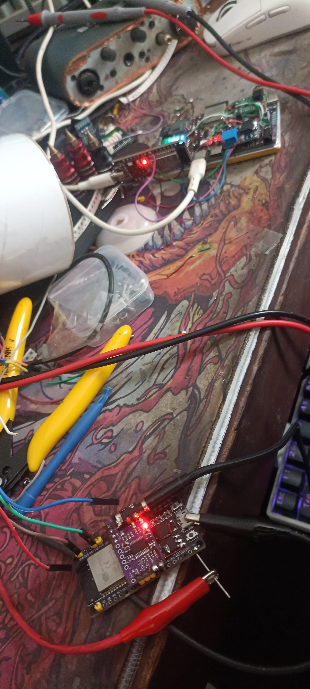
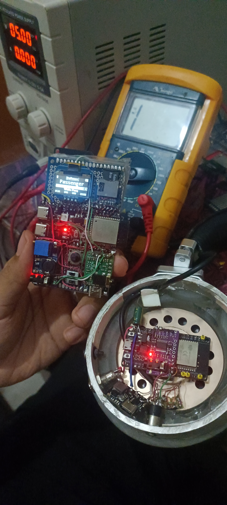

# Manual de Operação e Guia de Navegação — mps3

Este manual detalha o funcionamento de todas as telas, botões físicos, modos do gerenciador Wi-Fi, servidor Web e o equalizador de 10 bandas do reprodutor **mps3**.

<p align="center">
  
  
</p>

---

## 🕹️ 1. Mapeamento dos Botões Físicos (Joystick de 5 Vias)

O controle do **mps3** é operado por um joystick analógico/digital de 5 vias ou botões táteis equivalentes:

| Botão Físico | Pino no ESP32-S3 | Função Geral |
|:---:|:---:|---|
| **`UP`** | **GPIO 2** | Subir seleção / Aumentar valor / Entrar na Top Screen (Status). |
| **`DOWN`** | **GPIO 41** | Descer seleção / Diminuir valor / Sair da Top Screen para Reprodução. |
| **`LEFT`** | **GPIO 39** | Voltar pasta / Retroceder faixa / Diminuir balanço / Segurar 1s para sair de modos de tela cheia. |
| **`RIGHT`** | **GPIO 42** | Entrar em pasta / Selecionar / Avançar faixa / Aumentar balanço. |
| **`CENTER`** | **GPIO 40** | **Toque Curto:** Play / Pause / Confirmar.<br>**Toque Longo (700 ms):** Bloquear ou Desbloquear o dispositivo. |

---

## 🖥️ 2. Carrossel do Menu Principal (Tela Inicial)

Ao ligar o aparelho ou voltar à raiz do sistema, o display OLED exibe o menu em carrossel com ícones gráficos animados:

```text
[ 0. Player ]  <--->  [ 1. Wi-Fi ]  <--->  [ 2. Bluetooth ]  <--->  [ 3. Conf ]  <--->  [ 4. USB ]  <--->  [ 5. Life ]
```

Navegue entre os itens pressionando **`UP`** e **`DOWN`** e pressione **`CENTER`** ou **`RIGHT`** para entrar no módulo selecionado:

1. **`Player`**: Abre o navegador de pastas e arquivos de áudio do cartão MicroSD.
2. **`Wi-Fi`**: Inicia o servidor web sem fio para transferir e gerenciar músicas pelo navegador.
3. **`Bluetooth`**: Abre o menu de busca, pareamento e status de fones sem fio (LDAC/SBC).
4. **`Conf`**: Menu de preferências (Volume, Balanço L/R, Equalizador, LED RGB, Brilho da Tela e Timeout).
5. **`USB`**: Prompt de conexão com o computador (armazenamento ou DAC).
6. **`Life`**: Miniaplicativo autônomo do *Conway's Game of Life* renderizado no OLED (segure `LEFT` por 1s para sair).

---

## 🎵 3. Navegação de Músicas e Telas de Reprodução

### A. Navegador de Pastas (`Player Browser`)
* **`UP` / `DOWN`**: Rola a lista de músicas e diretórios. Segurar o botão acelera a rolagem.
* **`RIGHT`**: Entra no diretório selecionado ou inicia a reprodução do arquivo de áudio.
* **`LEFT`**: Retorna para a pasta anterior. Na raiz, volta para o carrossel do menu principal.
* **Retorno Rápido:** No topo da lista (`cursor = 0`), dar um toque rápido em `UP` leva diretamente para a tela de reprodução atual (*Now Playing*).

### B. Tela "Tocando Agora" (*Now Playing*)
Exibe o título da faixa, artista, álbum (com suporte a rolagem contínua *marquee* de nomes longos), crachá de formato (ex: `FLAC 24/96k`), barra de progresso, tempo decorrido e nível de bateria:

* **`CENTER` (Toque Curto)**: Alterna entre **Play** e **Pause**.
* **`CENTER` (Segurar 700 ms)**: **Bloqueia os botões** e apaga a tela para economizar bateria no bolso. Para desbloquear, segure `CENTER` por 700 ms novamente.
* **`DOWN`**: Sai da tela de reprodução e volta para o navegador de pastas.
* **`UP`**: Entra na **Top Screen (Barra de Status e Acesso Rápido)**.
* **`RIGHT` (Toque Rápido)**: Avança 5 segundos na música.
* **`RIGHT` (Dois Toques Rápidos)**: Pula para a **Próxima Faixa**.
* **`RIGHT` (Segurar)**: Realiza avanço rápido contínuo (*Seek Forward*) com aceleração exponencial sem estalos.
* **`LEFT` (Toque Rápido)**: Retrocede 5 segundos na música.
* **`LEFT` (Dois Toques Rápidos)**: Volta para a **Faixa Anterior**.
* **`LEFT` (Segurar)**: Realiza retrocesso rápido contínuo (*Seek Backward*).

### C. Top Screen (Tela Superior de Status)
Acessada apertando **`UP`** na tela de reprodução:
* Mostra a tensão precisa da bateria em Volts, porcentagem restante, estimativa de tempo de reprodução e atalho para o Equalizador.
* Permite ajustar o volume diretamente ou ligar/desligar o EQ com um clique. Aperte **`DOWN`** para retornar à tela de reprodução.

---

## 🌐 4. Modo Wi-Fi e Gerenciador Web (`mps3.local`)

O modo Wi-Fi permite gerenciar o conteúdo do cartão de memória sem remover o MicroSD do aparelho:

### Como Ativar:
1. No menu principal, selecione o ícone **Wi-Fi** e confirme com `CENTER`.
2. A tela do OLED exibirá o status de inicialização e o endereço de acesso. O sistema opera em dois modos:
   * **Modo Estação (STA):** Se houver uma rede Wi-Fi configurada, ele se conectará a ela e exibirá o IP obtido (ex: `192.168.1.50`).
   * **Modo Ponto de Acesso (AP - Hotspot):** Se não encontrar rede conhecida, o mps3 criará uma rede Wi-Fi própria com o nome `mps3-DAP` (ou similar). Conecte seu computador ou celular a esta rede.
3. Para sair do modo Wi-Fi a qualquer momento: **segure o botão `LEFT` por 1 segundo**. O rádio Wi-Fi será desligado e o cartão será remontado automaticamente.

### Acessando a Interface Web:
Abra qualquer navegador moderno (Chrome, Firefox, Safari, Edge) no mesmo Wi-Fi e acerte o endereço:
```text
http://mps3.local/
ou
http://<IP_MOSTRADO_NA_TELA>/
```

### Recursos Disponíveis no Painel Web:
* **Gerenciador de Arquivos:** Navegue pelas pastas do cartão, crie novos diretórios e renomeie pastas ou faixas.
* **Upload por Arrastar e Soltar (*Drag & Drop*):** Arraste álbuns inteiros ou múltiplos arquivos `.flac`, `.mp3` ou `.wav` direto para o navegador. Uma barra de progresso em tempo real mostra a taxa de transferência tanto no navegador quanto na tela do OLED do aparelho.
* **Exclusão Segura:** Apague faixas ou diretórios completos com um clique.
* **Monitoramento:** Mostra o espaço total e livre no MicroSD, além da porcentagem e tensão atual da bateria.

---

## 🎚️ 5. Equalizador Paramétrico de 10 Bandas

O equalizador do **mps3** utiliza filtros biquad de alta precisão processados no núcleo secundário (Core 1) para garantir resposta sonora transparente:

### Acesso e Configuração:
1. Acesse o menu **`Conf`** $\rightarrow$ **`Equalizador`**.
2. **Presets de Fábrica:** Escolha entre presets pré-calibrados (*Flat*, *Bass Boost*, *Vocal*, *Treble*, *Rock*, *Jazz*, etc.) ou crie perfis customizados.
3. **Edição Fina de Bandas:**
   * Pressione **`RIGHT`** sobre um preset para entrar na edição individual das frequências.
   * O display exibe as 10 bandas e o ganho geral (*Pre-Cut / Overall Gain*):
     $$\text{Bandas: } 31\text{Hz}, 62\text{Hz}, 125\text{Hz}, 250\text{Hz}, 500\text{Hz}, 1\text{kHz}, 2\text{kHz}, 4\text{kHz}, 8\text{kHz}, 16\text{kHz}$$
   * **`LEFT` / `RIGHT`**: Seleciona qual frequência você quer ajustar.
   * **`UP` / `DOWN`**: Aumenta ou diminui o ganho daquela frequência em passos de **1.0 dB** (faixa de $-15\text{ dB}$ a $+15\text{ dB}$).
   * **`CENTER`**: Liga ou desliga o Equalizador (*Bypass* manual imediato para comparação A/B).

> [!NOTE]
> **Bypass Automático em Faixas Hi-Res ($\ge 88.2\text{ kHz}$):**
> Quando você reproduz uma faixa em 96 kHz (como FLAC 24-bit/96kHz), o processador ativa o **bypass automático do equalizador**. Isso é feito propositalmente para garantir resposta de fase limpa e evitar degradação de sinal em alta resolução. Em faixas de 44.1 kHz e 48 kHz, o equalizador opera com potência total.

---

## ⚙️ 6. Menu de Configurações do Sistema (`Conf`)

Navegue até o menu **`Conf`** para ajustar preferências de hardware:

1. **Volume**: Ajuste digital da saída de áudio de 0% a 100%.
2. **Balanço L/R**: Compensa a intensidade entre o canal esquerdo e direito (ótimo para fones com sensibilidade desbalanceada ou preferências auditivas).
3. **Equalizador**: Acesso aos presets e curvas biquad.
4. **LED RGB**: Personaliza a cor e brilho do LED RGB WS2812 (permite ligar/desligar ou alterar os canais R, G e B).
5. **Tela**:
   * **Brilho do OLED**: 10 níveis de brilho para economizar bateria no escuro ou garantir visibilidade sob o sol.
   * **Timeout de Tela**: Tempo de inatividade para desligamento automático do display (`Desativado`, `15s`, `30s`, `1 min`, `2 min`, `5 min`).
